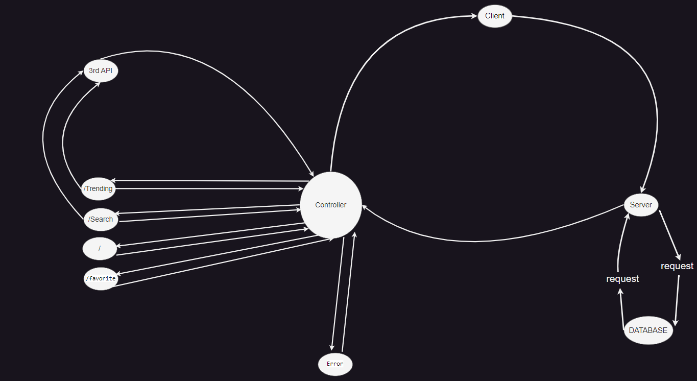

# Movies-Library

# Samara Movies - v1.0.0

**Author Name**: Mohamad Samara

## WRRC

## Overview

Movies Library is a server application that provides endpoints to retrieve movie data and handle favorite pages. It utilizes Express.js and Cors to handle HTTP requests.

## Getting Started

follow these steps:

1. Clone the repository:
2. Install the required dependencies (use npm i) :
3. Start the server (you can use alias "start" ==> [ npm start ] ):
4. Access the application endpoints on `http://localhost:3000/`
5. Set up environment variables:
      - Create `.env` file in the project and add `SECRET_API=c1af319ddec837daad4a88728e24a468`
6. if you need to return all movies just use `http://localhost:3000/trending`
7. if you need to Search for a movie name use `http://localhost:3000/search?query=(the name you want)`
8. if you need to add movie use `http://localhost:3000/addMovie` (with post request) and inside body send :
            {
            "t": "title",
            "r": "release_dat",
            "p": "poster_path",
            "o": "overview"
            }

9. if you need to return all movies in the database use  `http://localhost:3000/getMovies`( with get request)

            My DataBase => Name : movies ,
                     Table : movie ,
                     Cloumns : ( id , title , release_dat , poster_path , overview)

## Project Features

- **Home Page Endpoint: `/`**

      Returns movie data in JSON format.

- **Favorite Page Endpoint: `/favorite`**

      Returns a welcome message for the favorite page

- **trending Page Endpoint: `/trending`**

      Returns the trending movies data as object from the Movie DB API

- **search Page Endpoint: `/search`**

      Search for a movie name to get its information

- **getMovies Page Endpoint: `/getMovies`**

      Create a get request to get all the data from the database

- **addMovie Page Endpoint: `/addMovie`**

      create a post request to save a specific movie to database

- **Error Handling:**

      "Sorry, something went wrong" error (status 500) is handled by returning a JSON response with an error message

      "Page not found" error (status 404) is handled by returning a JSON response with an error message
